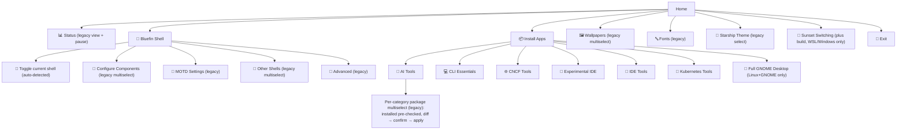

# Interactive Menu Structure

The interactive menu is a persistent TUI shell (`internal/tui/app`): a stack
of screens with a breadcrumb header, contextual footer, and a command palette.
This page maps the current flows and how they are tested.

## Navigation model

| Key | Action |
|-----|--------|
| `↑↓` / `j k` | move cursor |
| `enter` / `→` / `l` | select / drill in |
| `esc` / `←` / `backspace` / `h` | back (quits at root) |
| `/` | fuzzy-filter the current menu |
| `ctrl+p` | command palette (fuzzy search over every action) |
| `?` | help overlay |
| `g` / `G` | first / last item |
| `q` / `ctrl+c` | quit |

## Menu tree

Items marked *(legacy)* run outside the shell (terminal is handed over, then
the shell resumes) — they are candidates for native-screen migration.

```mermaid
graph TD
    Home[Home] --> Status["📊 Status (legacy view + pause)"]
    Home --> Shell[🐚 Bluefin Shell]
    Home --> Install[📦 Install Apps]
    Home --> Wallpapers["🖼 Wallpapers (legacy multiselect)"]
    Home --> Fonts["🔤 Fonts (legacy)"]
    Home --> Starship["🚀 Starship Theme (legacy select)"]
    Home --> Sunset["🌇 Sunset Switching (plus build, WSL/Windows only)"]
    Home --> Exit[👋 Exit]

    Shell --> Toggle["🔄 Toggle current shell (auto-detected)"]
    Shell --> Components["🔧 Configure Components (legacy multiselect)"]
    Shell --> MOTD["📰 MOTD Settings (legacy)"]
    Shell --> Shells["🐚 Other Shells (legacy multiselect)"]
    Shell --> Advanced["🎨 Advanced (legacy)"]

    Install --> AI["🤖 AI Tools"]
    Install --> CLI["💻 CLI Essentials"]
    Install --> CNCF["🌐 CNCF Tools"]
    Install --> XIDE["🧪 Experimental IDE"]
    Install --> IDE["📝 IDE Tools"]
    Install --> K8s["🎡 Kubernetes Tools"]
    Install --> Gnome["🐧 Full GNOME Desktop (Linux+GNOME only)"]

    AI --> Pkg["Per-category package multiselect (legacy):\ninstalled pre-checked, diff → confirm → apply"]
```

The `ctrl+p` palette lists every leaf destination above (Status, each install
category, Wallpapers, Fonts, Starship, Sunset) — one fuzzy search reaches
anything in the tree.

## How this is tested

Three layers, run by CI and `just` recipes:

1. **Model tests** (`internal/tui/app/app_test.go`): synchronous, deterministic
   tests of navigation state — push/pop, cursor movement, filtering, palette,
   help overlay — plus a direct render assertion on the composed frame.
2. **Menu wiring tests** (`cmd/menu_test.go`): every menu item and bundle
   category must resolve to an action, so a menu entry can never silently lead
   nowhere.
3. **End-to-end smoke** (`scripts/tui-smoke.sh`, `just tui-smoke`): drives the
   real binary in a tmux pane — sends actual keystrokes, captures the screen,
   and asserts rendering, drill-down, filter, palette, help, and quit.
