# Interactive Menu Structure

The Bluefin CLI provides a rich interactive menu system to manage your environment. Below is a diagram of the menu hierarchy and available options.

```mermaid
graph TD
    Main[Main Menu] --> Status[📊 Status]
    Main --> Shell[✨ Shell Shell Experience]
    Main --> Bundles[📦 Install Tools]
    Main --> Wallpapers[🖼  Wallpapers]
    Main --> Starship[🚀 Starship Theme]

    Shell --> ShellAction{Action}
    ShellAction -->|Toggle Current| ShellToggle[Enable/Disable Current Shell]
    ShellAction -->|Configure Components| ShellComps[Select Tools]
    ShellAction -->|MOTD Settings| MOTD[📰 MOTD]
    ShellAction -->|Manage Shells| ShellShells[Select Shells to Enable]

    ShellComps --> |Multi-Select| ShellToolsList[eza, ugrep, bat, atuin, starship, zoxide, uutils]
    ShellShells --> |Multi-Select| ShellsList[bash, zsh, fish]

    MOTD --> MOTDAction{Action}
    MOTDAction -->|Show| MOTDShow[Display MOTD]
    MOTDAction -->|Toggle| MOTDToggle[Select Shells to Enable]

    MOTDToggle --> |Multi-Select| ShellsList

    Bundles --> BundlesList[Select Bundles]
    BundlesList --> |Multi-Select| BundlesOptions[AI Tools, CLI Essentials, CNCF Tools, Experimental IDE, Fonts, IDE Tools, K8s Tools]

    Wallpapers --> WallpapersList[Select Wallpapers]
    WallpapersList --> |Multi-Select| WallpaperCasks[List from ublue-os/tap]

    Starship --> StarshipThemes[Select Theme]
    StarshipThemes --> |Select| ThemeOptions[Nerd Font Symbols, Tokyo Night, Catppuccin Powerline, etc.]
```

## Section Descriptions

- **Status**: Checks the current configuration and installation status of tools.
- **Shell Experience**: Manages shell enhancements like `eza`, `bat`, `starship`, etc. You can toggle them for specific shells or configure which tools are enabled. MOTD settings are also accessible from this menu.
- **MOTD**: Controls the "Message of the Day" that appears when you open a terminal. MOTD is enabled by default when you enable the Shell experience.
- **Install Tools**: Allows you to install curated bundles of Homebrew packages for various use cases (AI, Dev, Kubernetes, etc.).
- **Wallpapers**: Browse and install wallpapers available as Homebrew casks.
- **Starship Theme**: Quickly switch between different presets for the Starship prompt.
